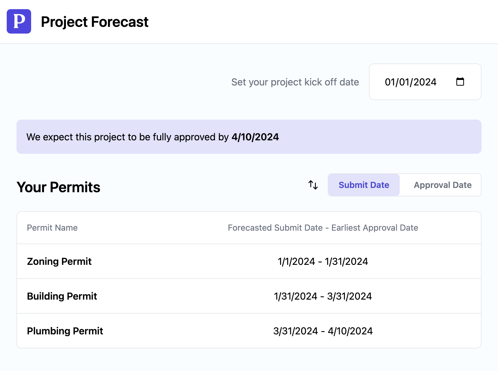

## Overview

At Pulley, we provide tools that help project teams manage and understand the
work required for their permits. One particular problem in permitting is when
the submission of one permit depends on the approval of another.

We want to provide our customers with an estimated forecast to simplify project
coordination and give a timeline for when they can expect to have all permits
approved.

## Problem statement

In this exercise, you're provided with an array of permit records
representing some permit data similar to what you might see in our database.

- Each permit has an "id" to uniquely identify it.
- The "name" property describes the name or type of the permit.
- "dependencyIds" is an array that contains the IDs of permits on which the
  current permit depends. For example, if a permit has no dependencies, its
  "dependencyIds" array is empty. **(Guaranteed to not be circular)**
- "estimatedDuration" represents the estimated duration of the permit process in
  days.

Given each permit's dependencies, and a toggle-able project kick off date,
provide forecasted submission and approval dates for each as well as the date we
can expect approval for the overall project.

### Example

| id  | name            | estimatedDuration | dependencyIds |
| --- | --------------- | ----------------- | ------------- |
| 1   | Building Permit | 60                | [3]           |
| 2   | Plumbing Permit | 10                | [1,3]         |
| 3   | Zoning Permit   | 30                | []            |

For the sample data above, we would want to prepare and submit the Zoning Permit first. Then once it is approved, we would be able to submit the Building Permit.
When we have approval for the Building Permit, we would finally be able to
submit the Plumbing Permit.

Assuming we have a project kick off date of Jan 1, 2024, the forecasted submit
and approval dates would look like:

| id  | name            | submitDate | approvalDate |
| --- | --------------- | ---------- | ------------ |
| 1   | Building Permit | 01-31-2024 | 03-31-2024   |
| 2   | Plumbing Permit | 03-31-2024 | 04-10-2024   |
| 3   | Zoning Permit   | 01-01-2024 | 01-31-2024   |

We could expect to have all permits approved by Apr 10, 2024.

## Solution

We've created a sample web app with React in typescript for you to build on. It
includes an input for the project kick off date, a single-row table for a sample
permit, and a switcher for changing the permit sort order.

Starting from the [forecast/index](src/forecast/index.tsx) file in the app,

- Use the data in [permitData](src/forecast/data.tsx) to calculate the forecasted submit
  and approval dates for the set of permits. If helpful, we've included a sample
  test in the [forecast.test](src/tests/forecast.test.ts) file you can use for validation.
- Allow for modifying the project kick off dates and have the forecasted dates
  for each permit update accordingly.
- Allow for sorting permits by submit or approval date, ascending.
- Update the [write-up/README.md](write-up/README.md) file with a short written description of your solution

With the data from our earlier example, you might wind up with a page that looks something like:

### Tips

- You should focus on making the app fully functional over styling.
- We've added a [helpers](src/forecast/helpers.tsx) file in Forecast which includes a boilerplate
  function for calculating the forecast for a set of permits. Feel
  free to implement that or write your own.
- We've defined some types for you to use in the [types](src/forecast/types.tsx) file, but please add
  more as needed.

### Submission

1. Create a **private** repo on GitHub, and clone it to your machine
2. Copy the files from this directory into your repo
3. Push an initial commit with the **starting template** as is. This is important - your submission will be a pull request so we can understand the diff.
4. Create a new branch to work off
5. Open a PR with _your_ changes
6. Once you have a solution you are happy with, share your repo with `charliejl28` 

### Running the app

    npm install

Will install dependencies needed to run the sample app.

    npm start

Runs the app in the development mode.\
Open [http://localhost:3000](http://localhost:3000) to view it in the browser.

The page will reload if you make edits.

    npm test

Launches the test runner in the interactive watch mode.

#### Packages included

We've added dayjs and lodash to the project. They can be helpful in date
manipulation and data aggregation if you're familiar, but you are not required
to use these packages. Everything in the problem statement can be accomplished
with the javascript built in libraries.
